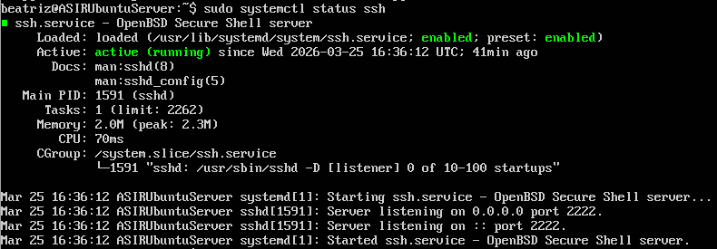
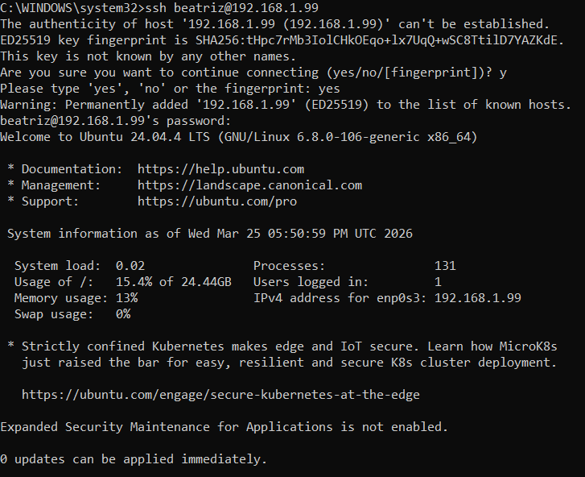
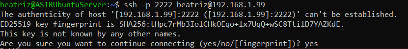

# Secure SSH Server on Ubuntu

Implementación y securización básica de un servicio SSH en Ubuntu Server para permitir acceso remoto seguro desde un equipo cliente.

## Objetivos
- Instalar y verificar el servicio OpenSSH.
- Comprobar conectividad remota desde un equipo externo.
- Aplicar medidas básicas de hardening.
- Configurar el firewall para permitir únicamente el acceso necesario.

## Entorno
- **Servidor:** Ubuntu Server en VirtualBox
- **Cliente:** equipo anfitrión
- **Red:** entorno virtual de laboratorio
- **Usuario administrativo:** usuario con privilegios sudo distinto de root

## Tecnologías utilizadas
- Ubuntu Server
- OpenSSH Server
- UFW
- VirtualBox

## Desarrollo del laboratorio

### 1. Preparación del sistema
Se actualizó el sistema operativo y se creó un usuario administrativo con permisos sudo para evitar el uso del usuario root en tareas de administración.

### 2. Instalación del servicio SSH
Se instaló `openssh-server` y se comprobó que el servicio estuviera activo y escuchando correctamente.

### 3. Verificación de red
Se identificó la dirección IP del servidor y se comprobó el puerto de escucha del servicio SSH.

### 4. Configuración del firewall
Durante las pruebas se detectó un problema de conectividad remota. El servicio SSH estaba activo, pero el firewall no permitía el puerto correcto, lo que impedía el acceso.
Se revisó la configuración de UFW y se habilitó el puerto necesario para permitir la conexión.

### 5. Conexión remota
Se realizó una conexión SSH desde el equipo anfitrión al servidor Ubuntu, validando que el acceso remoto funcionaba correctamente.

### 6. Hardening básico
Se aplicaron medidas de seguridad sobre el servicio SSH:
- deshabilitación del acceso del usuario root
- cambio del puerto por defecto 22 al puerto 2222
- actualización de reglas en UFW
- comprobación de acceso usando el nuevo puerto

## Medidas de seguridad aplicadas
- Uso de un usuario administrativo distinto de root
- `PermitRootLogin no`
- Cambio de puerto SSH a `2222`
- Apertura controlada del puerto necesario en UFW
- Cierre del puerto anterior tras validar el nuevo acceso

## Resultado
El servidor quedó accesible de forma remota mediante SSH, con una configuración más segura que la predeterminada y con validación funcional desde el equipo cliente.

## Mejoras futuras
- autenticación por clave pública
- deshabilitar autenticación por contraseña
- implementar Fail2ban
- revisar logs de autenticación

## Evidencias
Las capturas del proceso se encuentran en la carpeta `screenshots/`.

## Habilidades demostradas
- administración básica de Linux
- configuración de OpenSSH
- uso de firewall con UFW
- gestión de usuarios
- troubleshooting de conectividad
- hardening básico de acceso remoto

