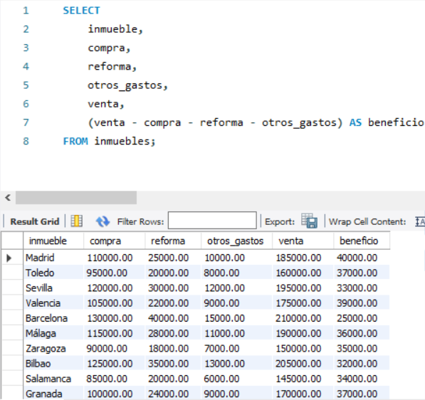
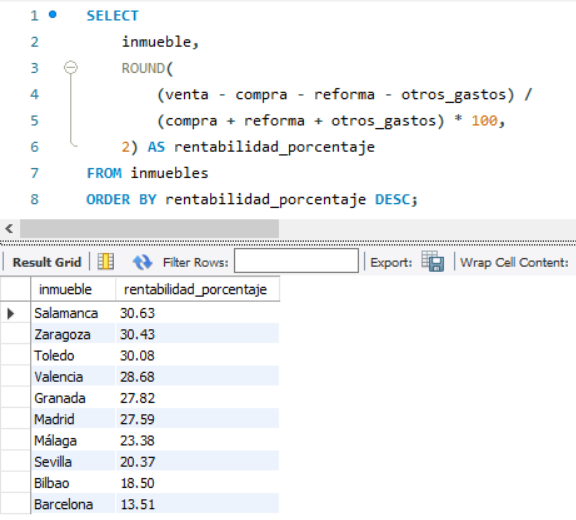
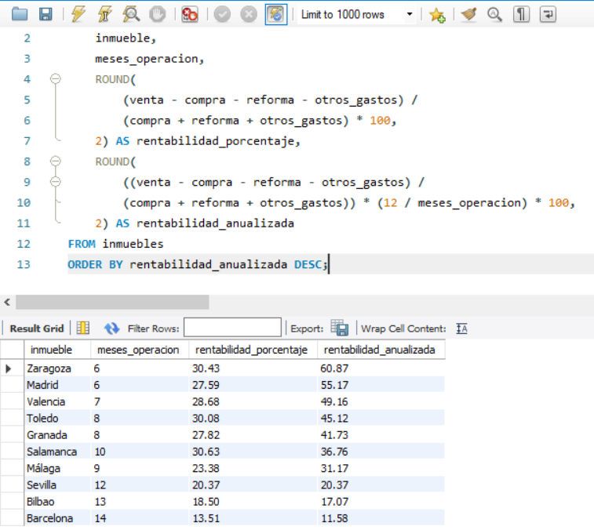
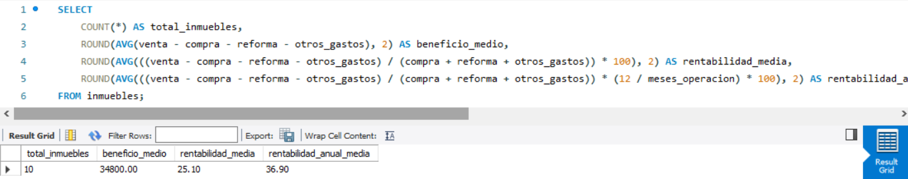

#  Base de datos inmobiliaria

Proyecto de base de datos en MySQL para guardar y analizar operaciones de inversión inmobiliaria.

---

##  Objetivo

Diseñar una base de datos sencilla que permita almacenar datos de operaciones inmobiliarias y hacer consultas sobre beneficio, rentabilidad y tiempo de operación.

---

##  Estructura

Se ha creado una base de datos llamada `inmobiliaria` con una tabla principal:

### Tabla: inmuebles

- id_inmueble  
- inmueble  
- compra  
- reforma  
- otros_gastos  
- venta  
- meses_operacion  

---

##  Funcionalidades implementadas

- Creación de base de datos y tabla
- Inserción de datos
- Cálculo de beneficio por inmueble
- Cálculo de rentabilidad (%)
- Ranking de inversiones
- Rentabilidad anualizada
- Consulta resumen global

---

##  Ejemplos de resultados

### Beneficio por inmueble

### Ranking de rentabilidad

### Rentabilidad anualizada

### Resumen final

---

##  Tecnologías utilizadas

- MySQL / MariaDB
- SQL

---

##  Archivos

- `base-datos-inmobiliaria.sql` → script completo del proyecto

---

##  Conclusión

Este proyecto permite analizar la rentabilidad de distintas inversiones inmobiliarias y comparar su rendimiento teniendo en cuenta el tiempo de operación.

---

##  Autor

Beatriz Esteban 
