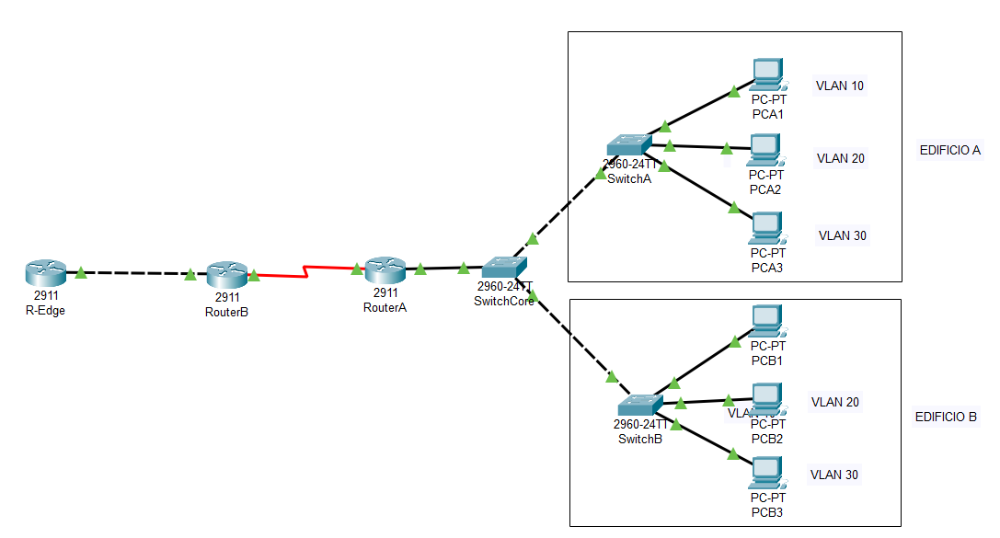
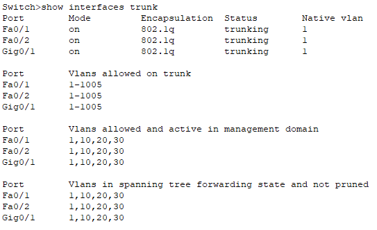
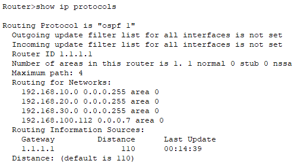
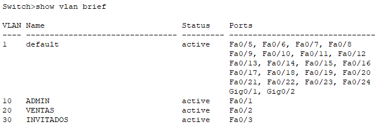
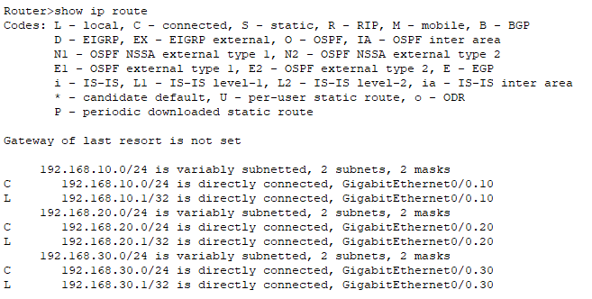
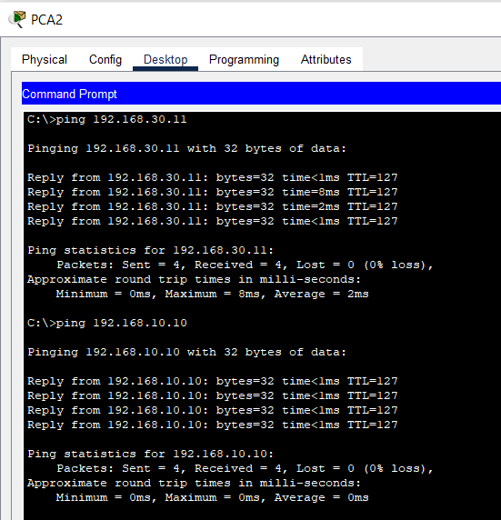

#  Red empresarial con VLANs, VLSM y OSPF

Proyecto de simulación de red en Cisco Packet Tracer que representa una infraestructura empresarial distribuida en dos edificios, con segmentación mediante VLANs y enrutamiento dinámico mediante OSPF.

---

##  Objetivo

Diseñar e implementar una red escalable y segmentada que permita:

- Separación lógica por departamentos (VLANs)
- Comunicación entre VLANs
- Conectividad entre diferentes ubicaciones (edificios)
- Uso de enrutamiento dinámico (OSPF)

---

##  Topología

La red está compuesta por:

- 3 routers (RouterA, RouterB, R-Edge)
- 3 switches (Core, SwitchA, SwitchB)
- 2 edificios (A y B)
- PCs distribuidos en VLANs

---

##  Segmentación de red

Se han configurado las siguientes VLANs en ambos edificios:

- VLAN 10 → Administración
- VLAN 20 → Ventas
- VLAN 30 → Invitados

Cada VLAN funciona como una red independiente, reduciendo tráfico broadcast y mejorando la seguridad.

---

##  Troncales

Los switches están conectados mediante enlaces trunk 802.1Q para permitir el tráfico de múltiples VLANs:

---

##  Enrutamiento entre VLANs

Se ha implementado **Router-on-a-Stick** para permitir la comunicación entre VLANs.

---

##  Enrutamiento dinámico (OSPF)

Se ha configurado OSPF en los routers para permitir el intercambio automático de rutas:

- Área: 0
- Redes anunciadas correctamente
- Comunicación entre routers verificada

---

##  Direccionamiento IP

Se ha utilizado:

- VLSM (Variable Length Subnet Mask)
- CIDR para resumen de rutas

Esto permite un uso eficiente de las direcciones IP y escalabilidad de la red.

---

##  Verificación

### VLANs configuradas

### Tabla de enrutamiento

### Conectividad (ping)

✔️ Comunicación entre VLANs  
✔️ Comunicación entre edificios  
✔️ Enrutamiento funcional  

---

##  Tecnologías utilizadas

- Cisco Packet Tracer
- VLAN (802.1Q)
- Trunking
- Router-on-a-Stick
- OSPF
- VLSM y CIDR

---

##  Archivos

- `4.pkt` → simulación completa de la red

---

##  Conclusión

Este proyecto simula una red empresarial real, aplicando segmentación, direccionamiento eficiente y enrutamiento dinámico, garantizando conectividad entre diferentes áreas de la organización.

---

##  Autor

Beatriz Esteban
