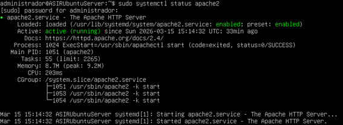
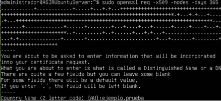
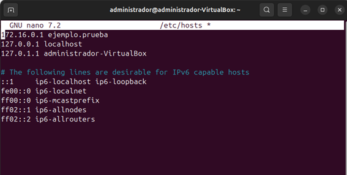

# Servidor web corporativo con Apache

Proyecto de instalación y configuración de un servidor web Apache en Ubuntu Server, con sitio virtual propio, HTTPS mediante certificado autofirmado y comprobación de logs.

## Objetivo

Montar un servidor web funcional en Linux, configurar un sitio virtual y habilitar acceso seguro mediante HTTPS.

## Entorno

* Servidor: Ubuntu Server
* Servicio web: Apache2
* Red: entorno virtual de laboratorio
* Cliente: navegador web para pruebas

## Desarrollo

Durante la práctica se realizaron los siguientes pasos:

* actualización del sistema
* instalación de Apache
* comprobación del estado del servicio
* revisión de la configuración con `apachectl configtest`
* creación del directorio del sitio web
* creación de la página `index.html`
* activación del módulo SSL
* generación de un certificado autofirmado con OpenSSL
* configuración de un Virtual Host para HTTPS
* resolución de nombre mediante `/etc/hosts`
* comprobación del acceso desde el navegador
* revisión de logs del servicio

## Qué se ha trabajado

* instalación y configuración de Apache
* configuración de Virtual Host
* activación de HTTPS
* creación de certificado autofirmado
* resolución de nombres en entorno local
* análisis básico de logs

## Evidencias

### Estado del servicio Apache

### Comprobación de la configuración

### Creación del certificado SSL

### Resolución de nombres en hosts

### Resultado final en navegador

## Tecnologías utilizadas

* Ubuntu Server
* Apache2
* OpenSSL
* VirtualBox

## Resultado

El servidor web quedó configurado correctamente y accesible mediante HTTPS en un entorno de laboratorio, con validación desde el navegador y revisión básica de registros.

## Mejoras futuras

* usar un certificado emitido por una CA real
* añadir redirección automática de HTTP a HTTPS
* reforzar la configuración de seguridad de Apache
* revisar logs de acceso y errores con más detalle
